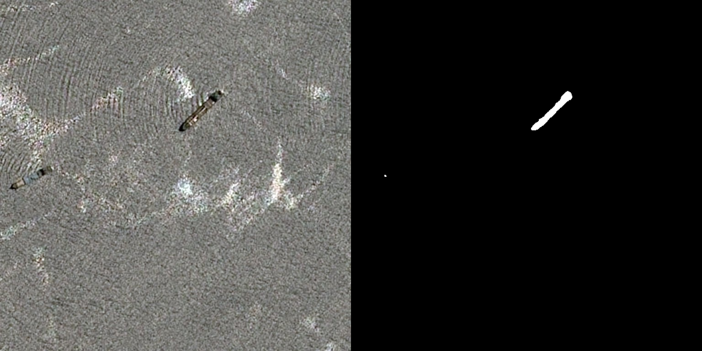
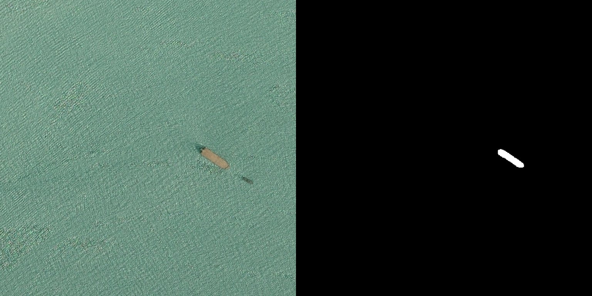
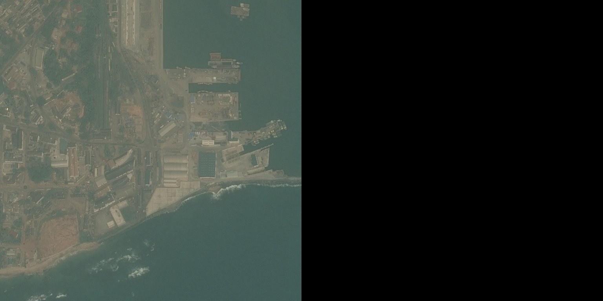

# Airbus-Ship-Detection-Challenge

## MiT-B0 with U-Net Architecture in Airbus Ship Detection Challenge
MiT-B0 with U-Net Architecture in Airbus Ship Detection Challenge
In our project, we harness the power of the MiT-B0 model as a backbone in a U-Net architecture, utilizing the implementation available in the segmentation_models.pytorch library. This combination is particularly effective for the task of ship detection in satellite imagery, providing both accuracy and efficiency.

## Overview of MiT-B0 with U-Net
MiT-B0 Backbone: MiT-B0 (Mix Transformer-Base 0) serves as the encoder in our U-Net architecture. It combines the strengths of CNNs and Transformers, offering a robust mechanism for capturing detailed spatial information in images.  
U-Net Architecture: U-Net is a widely-used architecture for image segmentation tasks. It features a symmetric encoder-decoder structure that excels in localizing and delineating object boundaries. The MiT-B0 backbone enhances U-Net's capability to process complex image patterns, making it highly effective for detecting ships in diverse satellite imagery.  
Efficiency and Performance: The MiT-B0 backbone ensures that the model remains computationally efficient while the U-Net structure provides precise segmentation results. This balance is crucial for processing large datasets like the one provided by Airbus.  
## Implementation Details
Integrated in PyTorch: Leveraging segmentation_models.pytorch, the implementation integrates seamlessly with the PyTorch framework, ensuring ease of use and flexibility.  
Dataset Adaptation: The model is fine-tuned on the Airbus Ship Detection dataset, addressing challenges such as varying image resolutions, lighting conditions, and ship sizes.  
Training and Evaluation: We employ various data augmentation techniques and preprocessing strategies to optimize the model's performance. The evaluation is conducted using standard segmentation metrics, ensuring the model's reliability and accuracy.  

## Results from the trained model at epoch 18




## Installation:
```bash
pip install -r requirements.txt
```
## Training:
```bash
python train.py
```
## Inference:
```bash
python inference.py
```
